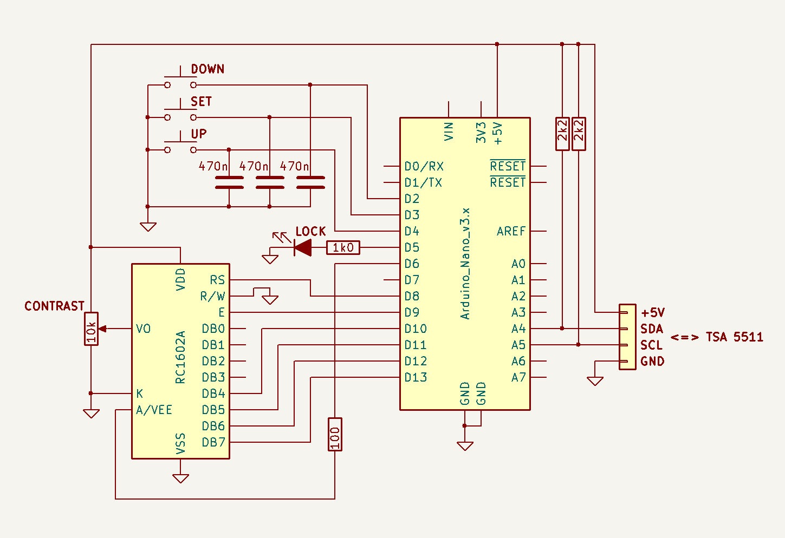

# TSA5511 PLL Controller for Arduino

# Description
PLL controller for the TSA5511, initially intended to replace the proprietary controller for the DRFS06 exciter by Dutch RF Shop, but it can be used for any other TSA5511-based exciter, operating in a VCO frequency range of 64 MHz up to 1,300 MHz as per specification of the TSA5511.
It features an intuitive menu interface for configuring system settings and a quick menu for frequently used functions, as described in detail below. Persistent system settings and user memories are stored in EEPROM and automatically recalled upon restart.

# Hardware
- Circuit diagram


- The hardware comprises an Arduino Nano or compatible, a standard 16x2 LCD display (used in 4-bit mode) with backlight and contrast adjustment, three pushbuttons (DOWN/SET/UP, each with a 470 nF debouncing capacitor across its contact) and an optional PLL lock LED which also acts as a blinking fault indicator. The lock status is also shown on the LCD display.
- LCD backlight control is available if connected to its reserved digital pin. Refer to code for pin mappings and change if necessary. Note that the digital pin used for the LCD backlight must support PWM. Currently pin 6 is configured, which is valid on common Arduino boards.
- The current EEPROM layout requires at least 1 kB EEPROM, as provided by ATmega328P-based Arduino Nano boards.
- Pull-up resistors on SDA/SCL are required. Especially if SDA/SCL runs through RF-decoupling circuitry, you may want to use lower values for reliable communication, such as 1 or 2 kΩ.
- If used with the DRFS06 it is recommended to supply the controller separately from the TSA5511, as slight voltage fluctuations on the TSA5511 supply rail may cause a few ppm XTAL frequency deviation.

# Usage
- Double-clicking SET opens the SYSTEM SETTINGS menu. In system submenus, holding SET returns one level back while keeping pending changes in the temporary menu state until they are explicitly saved or discarded. In the station name editor, SET confirms characters and holding SET returns from the editor while keeping the edited temporary name until it is explicitly saved or discarded. The available system settings are as follows:

```text

    ■ VCO SETTINGS     => • FREQUENCY BAND   > Various predefined frequency bands are available for selection. The last operating frequency will be stored in EEPROM for
                                               each VCO frequency band and XTAL frequency separately. The last selected VCO frequency band will be stored in EEPROM for
                                               each XTAL frequency separately as well.
                          • PRECISION        > This sets the decimal precision at which the VCO frequency can be set and will be displayed. Note that if it is set to a
                                               lower precision than required for the current VCO frequency, confirmation will result in the new VCO frequency being
                                               rounded and set to the nearest possible value. Since the minimum VCO frequency step size is derived from the PLL crystal
                                               frequency and the /8 prescaler (25 kHz @ 1.6 MHz and 50 kHz @ 3.2 MHz), the actual frequency precision will default to the
                                               highest possible resolution automatically, i.e. 3 decimals at 1.6 MHz and 2 decimals at 3.2 MHz respectively. This can be
                                               changed to a lower value if so desired. Refer to additional explanation below at PLL SETTINGS > XTAL FREQUENCY.
                          • RETURN           > Returns to the main settings menu.

    ■ PLL SETTINGS     => • I2C ADDRESS      > This allows selecting the appropriate I²C address based on the actual hardware configuration of the TSA5511.
                                               By applying a DC bias to pin P3 of the TSA5511, the I²C address can be configured to 0x60, 0x62, or 0x63, while 0x61 is
                                               always valid regardless of the hardware configuration. By default the I²C address is set to 0x61.
                                               When saving changes after selecting a new I²C address, communication is automatically verified. If verification fails, the
                                               last known working I²C address will be restored automatically. In the unlikely event that an incompatible I²C address is
                                               stored and cannot be reconfigured through the menu, reset or power-cycle the controller while holding SET to restore the
                                               default fail-safe I²C address (0x61).
                          • XTAL FREQUENCY   > This setting must match the actual PLL crystal frequency. The default PLL crystal frequency is 3.2 MHz, resulting in a
                                               theoretical upper VCO frequency of 1,638.35 MHz. If a PLL crystal frequency of 1.6 MHz is used, the theoretical upper VCO
                                               frequency will be 819.175 MHz, in which case any upper band limit exceeding this maximum value will be automatically
                                               adjusted accordingly.
                                               Note that compatibility of the TSA5511 with a 1.6 MHz crystal frequency is not officially supported; however, it has been
                                               empirically confirmed to work.
                          • CHARGE PUMP      > This sets the PLL charge-pump current in locked state to high (220 µA) or low (50 µA). It should be set to high for the
                                               DRFS06 exciter or to low for other platforms if required. The varicap drive can also be disabled for testing purposes.
                          • PORT MAPPING     > This setting maps corresponding output ports on the TSA5511 to drive an external lock indicator, an external unlock
                                               indicator and the transmitter RF output stage respectively. When using TSA5511 package variants with fewer available
                                               output ports, make sure that PORT MAPPING only selects physically available ports.
                          • RETURN           > Returns to the main settings menu.

    ■ GENERAL SETTINGS => • STATION NAME     > This sets the radio station name that is shown in the idle locked state. Select characters using UP/DOWN and confirm each
                                               character with SET. Hold UP/DOWN to auto-scroll characters; hold SET to return from the editor.
                          • BACKLIGHT DIMMER > This toggles the automatic LCD backlight dimmer function (on or off).
                          • SHOW MENU TITLE  > This toggles the animated title screen when entering SYSTEM SETTINGS or QUICK MENU.
                          • FACTORY RESET    > This clears all stored settings and user memories and restores the default settings after double confirmation. This action
                                               is applied immediately and does not require EXIT SETTINGS > save changes.
                          • RETURN           > Returns to the main settings menu.

    ■ EXIT SETTINGS    => • save changes     > Stores any changes to EEPROM and returns to the main interface.
                          • discard          > Discards any changes and returns to the main interface.
                          • cancel           > Returns to the first index of the main menu.

```

- Press and hold SET from the main interface to open the QUICK MENU, which provides access to frequently used end-user functions. Within the QUICK MENU, holding SET returns one level back, or exits the menu from its top level. The QUICK MENU provides the following functions:

```text

    ■ QUICK MENU       => • RECALL MEMORY    > Recalls one of six user-stored VCO frequencies for the current VCO frequency band and XTAL frequency.
                          • SAVE MEMORY      > Saves the current VCO frequency in one of six user memory slots for the current VCO frequency band and XTAL frequency.
                          • CLEAR MEMORY     > Clears one of the user memory slots for the current VCO frequency band and XTAL frequency.
                          • RF DRIVE         > Temporarily enables or disables the RF drive output without storing the state in EEPROM.
                                               When off, the station name alternates with an RF DRIVE: OFF status message.
                          • LCD OFF          > Smoothly fades out and turns off the LCD backlight until any button is pressed.
                          • EXIT QUICK MENU  > Returns to the main interface.

```

- The SYSTEM SETTINGS menu will time out after a preset period of inactivity, discarding any unsaved changes and returning to the main screen — except when the save/discard/cancel exit menu is active, which requires explicit user confirmation.
- The QUICK MENU will also time out after a preset period of inactivity and return to the main screen; its actions are applied immediately.
- Change VCO frequency using UP/DOWN and confirm with a short SET press. Holding SET cancels the frequency change and returns to the main screen unchanged. Holding UP/DOWN will auto-sweep through the VCO frequency band with gradual acceleration. If no confirmation is given, the frequency edit will time out unchanged.
- PLL lock is verified after programming. To prevent false unlock indications caused by FM modulation, lock-flag polling is intentionally stopped after lock has been detected; periodic TSA5511 status monitoring nevertheless remains active, including during menu operation and frequency editing.
- If enabled, the LCD backlight will dim after a preset period in quiescent state (locked). The LCD backlight can be smoothly faded out and turned off completely from the QUICK MENU and will be restored by pressing any button.
- I²C communication loss is indicated and retried automatically. Any active menu is closed with unsaved changes discarded and any unconfirmed frequency edit is cancelled. After communication is restored, the PLL is fully reprogrammed only if a write may have failed or the TSA5511 POR flag indicates an unexpected reset. After a read-only interruption without POR, the existing programming is retained; if lock was lost, acquisition control and lock verification are resumed.
