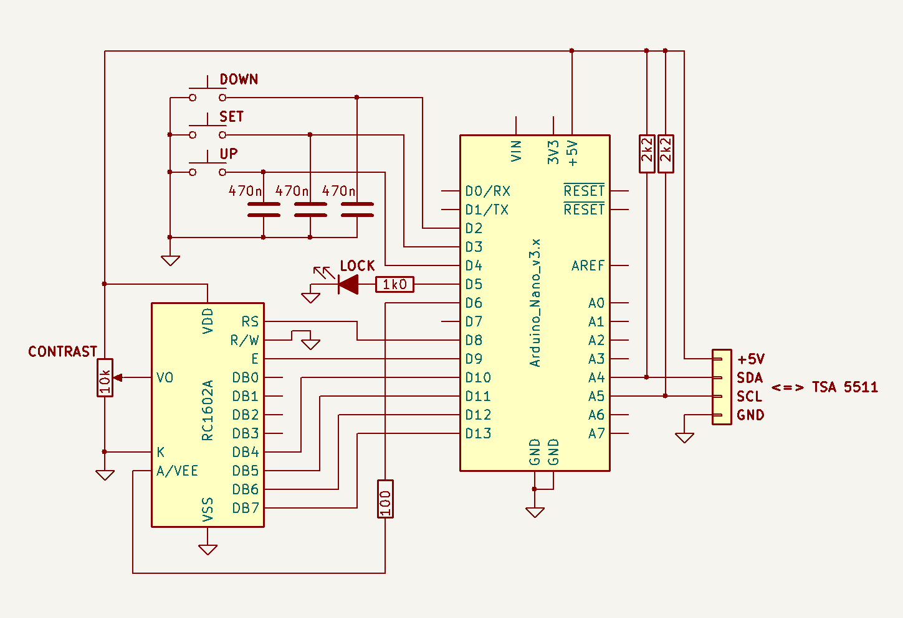

# TSA5511 PLL Controller for Arduino

**Current firmware: v5.2.1**

# Description
PLL controller for the TSA5511, initially intended to replace the proprietary controller for the DRFS06 exciter by Dutch RF Shop, but it can be used for any other TSA5511-based exciter, operating in a VCO frequency range of 64 MHz up to 1,300 MHz as per specification of the TSA5511.
It features an intuitive menu interface for configuring system settings, a quick menu for frequently used functions and a hidden service menu for diagnostics, system information and maintenance functions, as described in detail below. Persistent system settings and user memories are stored in EEPROM and automatically recalled upon restart.

# Interactive demo
A browser-based interactive demo is available to explore the virtual 16x2 LCD interface, button controls, System Menu, Quick Menu, hidden Service Menu, live diagnostics, virtual TSA5511 status/output ports and simulated I²C/POR recovery scenarios without requiring physical hardware.

[Launch the interactive demo](https://spiderblocker.github.io/TSA5511_PLL_Controller_Arduino/demo.html)

The demo is a functional simulation for demonstration purposes and does not communicate with a physical TSA5511 or Arduino controller. Saved demo settings remain local to the browser.

# Hardware
- Circuit diagram


- The hardware comprises an Arduino Nano or compatible, a standard 16x2 LCD display (used in 4-bit mode) with backlight and contrast adjustment, three pushbuttons (DOWN/SET/UP, each with a 470 nF debouncing capacitor across its contact) and an optional PLL lock LED which also acts as a blinking fault indicator. The lock status is also shown on the LCD display.
- LCD backlight control is available if connected to its reserved digital pin. Refer to code for pin mappings and change if necessary. Note that the digital pin used for the LCD backlight must support PWM. Currently pin 6 is configured, which is valid on common Arduino boards.
- The current EEPROM layout requires at least 1 kB EEPROM, as provided by ATmega328P-based Arduino Nano boards. A compile-time boundary check prevents the user-memory bank from exceeding this capacity.
- Pull-up resistors on SDA/SCL are required. Especially if SDA/SCL runs through RF-decoupling circuitry, you may want to use lower values for reliable communication, such as 1 or 2 kΩ.
- If used with the DRFS06 it is recommended to supply the controller separately from the TSA5511, as slight voltage fluctuations on the TSA5511 supply rail may cause a few ppm XTAL frequency deviation. This also allows unexpected TSA5511 POR events to be detected and counted; if both devices are power-cycled together, the POR count is reset with the controller.

# Usage
- Double-clicking SET opens the SYSTEM MENU. All system-setting edits remain in a temporary menu state and do not affect the active PLL/runtime configuration until **save changes** is selected. System submenu settings show `SET to edit` while browsing; ordinary edit fields show the selected value prefixed with `>`, while the station-name editor uses its blinking cursor. Holding SET returns one level back while keeping pending changes until they are explicitly saved or discarded. A `*` at the upper-right of EXIT MENU marks pending unsaved changes. In the station name editor, SET confirms characters and holding SET returns from the editor while keeping the edited temporary name until it is explicitly saved or discarded. The available system settings are as follows:

```text

    ■ VCO SETTINGS     => • FREQUENCY BAND   > Selectable bands are FM OIRT, FM Japan, FM World, 2 m, 70 cm, UHF and 64-1300 MHz. The last operating frequency will be
                                               stored in EEPROM for each VCO frequency band and XTAL frequency separately. The last selected VCO frequency band will be stored in EEPROM for
                                               each XTAL frequency separately as well.
                          • PRECISION        > This sets the decimal precision at which the VCO frequency can be set and will be displayed. Note that if it is set to a
                                               lower precision than required for the current VCO frequency, confirmation will result in the new VCO frequency being
                                               rounded and set to the nearest possible value. User memories retain their exact stored frequency independently of this
                                               setting; recalling a memory automatically raises precision only when required to reproduce that frequency exactly and
                                               never lowers it. Since the minimum VCO frequency step size is derived from the PLL crystal frequency and the /8 prescaler
                                               (25 kHz @ 1.6 MHz and 50 kHz @ 3.2 MHz), the actual frequency precision will default to the highest possible resolution
                                               automatically, i.e. 3 decimals at 1.6 MHz and 2 decimals at 3.2 MHz respectively. This can be changed to a lower value if
                                               so desired. Refer to additional explanation below at PLL SETTINGS > XTAL FREQUENCY.
                          • RETURN           > Returns to the main settings menu.

    ■ PLL SETTINGS     => • I2C ADDRESS      > This allows selecting the appropriate I²C address based on the actual hardware configuration of the TSA5511.
                                               By applying a DC bias to pin P3 of the TSA5511, the I²C address can be configured to 0x60, 0x62, or 0x63, while 0x61 is
                                               always valid regardless of the hardware configuration. By default the I²C address is set to 0x61.
                                               When saving changes after selecting a new I²C address, communication is automatically verified. If verification fails, the
                                               last known working I²C address will be restored automatically. In the unlikely event that an incompatible I²C address is
                                               stored and cannot be reconfigured through the menu, reset or power-cycle the controller while holding SET to open the
                                               SERVICE MENU, then select and confirm I2C FALLBACK to restore the default fail-safe I²C address (0x61).
                          • XTAL FREQUENCY   > This setting must match the actual PLL crystal frequency. The default PLL crystal frequency is 3.2 MHz, resulting in a
                                               theoretical upper VCO frequency of 1,638.35 MHz. If a PLL crystal frequency of 1.6 MHz is used, the theoretical upper VCO
                                               frequency will be 819.175 MHz, in which case any upper band limit exceeding this maximum value will be automatically
                                               adjusted accordingly.
                                               Note that compatibility of the TSA5511 with a 1.6 MHz crystal frequency is not officially supported; however, it has been
                                               empirically confirmed to work.
                          • CHARGE PUMP      > This sets the PLL charge-pump current in locked state to high (220 µA) or low (50 µA). It should be set to high for the
                                               DRFS06 exciter or to low for other platforms if required. The varicap drive can also be disabled for testing purposes.
                          • PORT MAPPING     > This setting maps corresponding output ports on the TSA5511 to drive an external lock indicator, an external unlock
                                               indicator and the transmitter RF output stage respectively. When using TSA5511 package variants with fewer available
                                               output ports, make sure that PORT MAPPING only selects physically available ports.
                          • RETURN           > Returns to the main settings menu.

    ■ GENERAL SETTINGS => • STATION NAME     > This sets the radio station name that is shown in the idle locked state. Select characters using UP/DOWN and confirm each
                                               character with SET. Hold UP/DOWN to auto-scroll characters; hold SET to return from the editor.
                          • BACKLIGHT DIMMER > This toggles the automatic LCD backlight dimmer function (on or off).
                          • SHOW MENU TITLE  > This toggles the animated title screen when entering SYSTEM MENU, QUICK MENU or SERVICE MENU.
                          • RETURN           > Returns to the main settings menu.

    ■ EXIT MENU        => Returns directly to the main interface if no settings were changed. A "*" at the upper-right marks pending unsaved changes. Otherwise:
                          • save changes     > Stores any changes to EEPROM and returns to the main interface.
                          • discard          > Discards any changes and returns to the main interface.
                          • cancel           > Returns to the first index of the main menu.

```

- Press and hold SET from the main interface to open the QUICK MENU, which provides access to frequently used end-user functions. Within the QUICK MENU, holding SET returns one level back, or exits the menu from its top level. The QUICK MENU provides the following functions:

```text

    ■ QUICK MENU       => • RECALL MEMORY    > Recalls one of six exact user-stored VCO frequencies for the current VCO frequency band and XTAL frequency. If required,
                                               precision is automatically raised just enough to reproduce the stored frequency exactly, but is never lowered.
                          • SAVE MEMORY      > Saves the exact current VCO frequency in one of six user memory slots for the current VCO frequency band and XTAL frequency.
                          • CLEAR MEMORY     > Clears one of the user memory slots for the current VCO frequency band and XTAL frequency.
                          • RF DRIVE         > Temporarily enables or disables the RF drive output without storing the state in EEPROM.
                                               When off, the station name alternates with an RF DRIVE: OFF status message.
                          • LCD OFF          > Turns off the LCD backlight until any button is pressed.
                          • EXIT MENU        > Returns to the main interface.

```

- Hold UP and DOWN together for 1 second from the main interface to open the hidden SERVICE MENU. A brief chord-acquisition window delays the first individual UP/DOWN action just long enough to recognize the combination without briefly entering frequency edit mode; this service gesture remains available during runtime I²C recovery. Alternatively, hold SET through the startup splash screen to enter the SERVICE MENU before normal PLL initialization. The SERVICE MENU provides service information and maintenance functions:

```text

    ■ SERVICE MENU     => • DIAGNOSTICS      > Shows live TSA5511 lock/input status, live/completed PLL lock acquisition timing, PLL divisor and unexpected POR count.
                                               It also shows the current I²C address, successfully completed I²C recovery count, controller uptime and the last successfully
                                               programmed output-port bitmap. Use UP/DOWN to browse the read-only pages; select RETURN TO MENU or hold SET to return to
                                               the SERVICE MENU. Before normal PLL initialization, DIAGNOSTICS uses read-only I²C probing; live TSA5511 values remain '-'
                                               until the first successful status read. Failed reads mark affected pages with '!' and blink the fault indicator immediately until
                                               communication returns, while sustained startup failures replace stale live values with '-'. The first successful read establishes the expected power-on POR baseline;
                                               later POR events and sustained I²C losses that subsequently recover are counted. Lock timing, PLL divisor and output-port
                                               command data are shown as not initialized.
                          • SYSTEM INFO      > Shows the full firmware version and copyright information.
                          • I2C FALLBACK     > Available only when the SERVICE MENU is entered during startup; restores the fail-safe I²C address (0x61) after a single
                                               NO/YES confirmation and returns to the startup SERVICE MENU. Normal initialization resumes only after explicitly leaving the menu.
                          • FACTORY RESET    > Clears all stored settings and user memories and restores the default settings after double confirmation. During the reset,
                                               the dedicated FACTORY RESET / resetting... status remains visible for at least 750 ms (or longer if the reset itself takes longer).
                          • EXIT MENU        > Returns to the main interface, or resumes normal initialization when the SERVICE MENU was entered during startup.

```

- The SYSTEM MENU will time out after a preset period of inactivity, discarding any unsaved changes and returning to the main interface. The save/discard/cancel exit menu requires explicit user action. During normal operation, the SERVICE MENU and DIAGNOSTICS use a longer inactivity timeout before returning to the main interface; when entered during startup, SERVICE MENU/DIAGNOSTICS do not time out and normal initialization resumes only after explicit user action.
- The QUICK MENU will also time out after a preset period of inactivity and return to the main interface; its actions are applied immediately.
- Change VCO frequency using UP/DOWN and confirm with a short SET press. Holding SET cancels the frequency change and returns to the main interface unchanged. Holding UP/DOWN will auto-sweep through the VCO frequency band with gradual acceleration. If no confirmation is given, the frequency edit will time out unchanged. A UP+DOWN chord that began during frequency editing is consumed until both buttons are released, so it cannot open the Service Menu after the frequency-edit timeout.
- PLL lock is verified after programming. To prevent false unlock indications caused by FM modulation, operational lock-flag polling is intentionally stopped after lock has been detected; periodic TSA5511 status monitoring nevertheless remains active, including during menu operation and frequency editing. DIAGNOSTICS refreshes the live lock/input information for display without overriding the operational lock state or output-port control; it also exposes PLL divisor, current I²C address, recovery count and controller uptime, while unexpected POR indications remain handled by the normal recovery logic.
- If enabled, the LCD backlight will dim after a preset period in quiescent state (locked). The LCD backlight can be turned off completely from the QUICK MENU and will be restored by pressing any button.
- During normal operation, I²C communication loss is indicated and retried automatically. System/Quick menus are closed and any unconfirmed frequency edit is cancelled, while the SERVICE MENU remains accessible through its normal UP+DOWN gesture. DIAGNOSTICS stays browsable during recovery; a fixed `!` at the upper-right marks affected data pages except I2C ADDRESS, I2C RECOVERIES and SYSTEM UPTIME; SYSTEM UPTIME continues to refresh, live FL/input fields show `-` and PLL lock time shows `<unknown>` (the RETURN TO MENU navigation page remains unmarked). A read-only interruption also invalidates the measured lock time until a new uninterrupted acquisition starts. Pending settings are still discarded for safety. The I²C recovery counter is incremented only after recovery has successfully completed. After communication is restored, the PLL is fully reprogrammed only if a write may have failed or the TSA5511 POR flag indicates an unexpected reset; after a read-only interruption without POR, existing programming is retained and lock verification resumes as needed.
